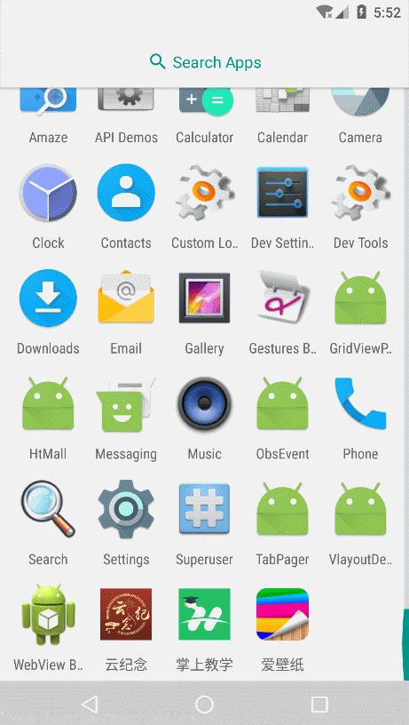

# ObsEvent


> 一个简洁又好用的事件管理框架。
>
> 采用观察者模式。只需要在将要接收事件的页面实现`EvtObserver`接口，并注册该事件注册到事件管理器`EvtManager`中，在页面销毁时再注销当前事件(不注销的话可能会导致`OOM`)

### Demo

* 效果图：



* 下载体验[ObsEvent](https://fir.im/8vfc)：

  


### 用法

* 添加依赖

  ```groovy
  dependencies {
    compile 'com.yhy.event:obsevt:lastestVersion'
  }
  ```


* 在接收事件的页面实现`EvtObserver`接口，在`getEvtCode()`方法中返回本页所有的事件`code`数组，在`notifyEvt(int evtCode, Bundle data)`方法中解析事件。

  ```java
  public class MainActivity extends AppCompatActivity implements EvtObserver {
    /**
     * 事件响应，解析事件
     * @param evtCode 事件code
     * @param data    事件携带的数据
     */
    @Override
    public void notifyEvt(int evtCode, Bundle data) {
      // 其他页面触发事件后该方法就被调用
      if (evtCode == 200) {
        if (null == data) {
          tvPageFirst.setText("200-data为空");
        } else {
          tvPageFirst.setText("200-" + data.getString("data"));
        }
      } else if (evtCode == 201) {
        if (null == data) {
          tvPageFirst.setText("201-data为空");
        } else {
          tvPageFirst.setText("201-" + data.getString("data"));
        }
      }
    }

    @Override
    public int[] getEvtCode() {
      // 确定本页面的事件code，也就是说本页面只接收code为200和201的事件
      return new int[]{200, 201};
    }
  }
  ```

* 注册事件，在页面初始化时注册当前事件到事件管理器中

  ```java
  public class MainActivity extends AppCompatActivity implements EvtObserver {
    @Override
    protected void onCreate(Bundle savedInstanceState) {
      // 注册事件
      EvtManager.getInstance().regist(this);
    }
  }
  ```

* 触发事件，在需要触发事件的页面直接通过事件管理器和事件`code`来触发事件

  ```java
  public class TestActivty extends AppCompatActivity {

    @Override
    protected void onCreate(@Nullable Bundle savedInstanceState) {
      super.onCreate(savedInstanceState);
      setContentView(R.layout.activity_sub);

      findViewById(R.id.tv_test_first).setOnClickListener(new View.OnClickListener() {
        @Override
        public void onClick(View view) {
          Bundle args = new Bundle();
          args.putString("data", "数据测试1");
  		// 只能触发200事件
          EvtManager.getInstance().notifyEvt(200, args);
          finish();
        }
      });

      findViewById(R.id.tv_test_second).setOnClickListener(new View.OnClickListener() {
        @Override
        public void onClick(View view) {
          Bundle args = new Bundle();
          args.putString("data", "数据测试2");
          // 只能触发201事件
          EvtManager.getInstance().notifyEvt(201, args);
          finish();
        }
      });

      findViewById(R.id.tv_test_third).setOnClickListener(new View.OnClickListener() {
        @Override
        public void onClick(View view) {
          Bundle args = new Bundle();
          args.putString("data", "只改变的二页");
          // 只能触发202事件
          EvtManager.getInstance().notifyEvt(202, args);
          finish();
        }
      });

      findViewById(R.id.tv_test_forth).setOnClickListener(new View.OnClickListener() {
        @Override
        public void onClick(View view) {
          // 触发200事件，不带任何数据
          EvtManager.getInstance().notifyEvt(200);
          finish();
        }
      });
    }
  }
  ```

* 注销事件，在页面销毁时注销当前事件，避免`OOM`

  ```java
  public class MainActivity extends AppCompatActivity implements EvtObserver {
    @Override
    protected void onDestroy() {
      // 注销事件
      EvtManager.getInstance().unRegist(this);
    }
  }
  ```

### License

```tex
Copyright 2017 yhyzgn

Licensed under the Apache License, Version 2.0 (the "License");
you may not use this file except in compliance with the License.
You may obtain a copy of the License at

http://www.apache.org/licenses/LICENSE-2.0

Unless required by applicable law or agreed to in writing, software
distributed under the License is distributed on an "AS IS" BASIS,
WITHOUT WARRANTIES OR CONDITIONS OF ANY KIND, either express or implied.
See the License for the specific language governing permissions and
limitations under the License.
```

